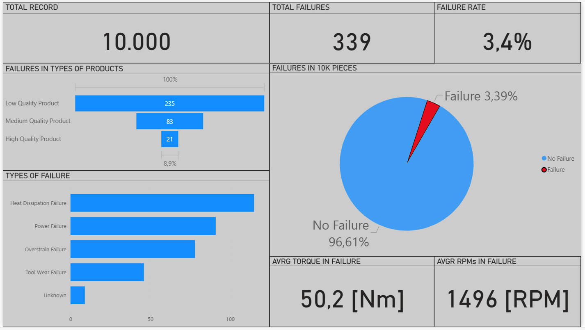
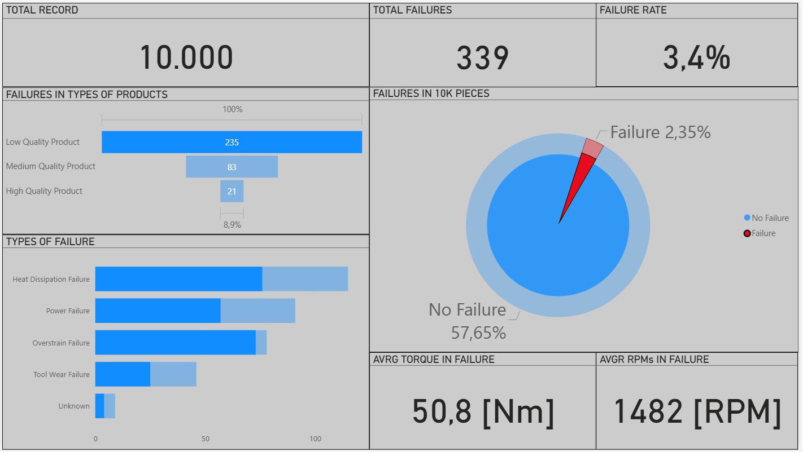

# DashBoard_Maintenance
An end-to-end industrial analytics project integrating IoT-style data, Dockerized PostgreSQL, SQL modeling, Power Query, DAX, and Power BI visualization.

🏭Este proyecto simula un flujo típico de datos industriales:
sensores IoT → base de datos PostgreSQL en Docker → modelado SQL → Power BI Desktop → dashboard analítico de fallas.

##📦 1. Dataset utilizado
Para este proyecto utilicé el dataset Machine Predictive Maintenance Classification de Kaggle. Contiene 10.000 registros sintéticos con variables típicas de maquinaria industrial: temperatura, torque, RPM, desgaste de herramienta y diferentes tipos de fallas.
Este conjunto de datos es ideal para practicar análisis de confiabilidad y mantenimiento predictivo. A partir de él construí todo el flujo de trabajo.

Dataset original:
Machine Predictive Maintenance Classification
Fuente: https://www.kaggle.com/datasets/shivamb/machine-predictive-maintenance-classification/data

##🐳 2. Entorno Docker + PostgreSQL
Monté un entorno local usando Docker Desktop con PostgreSQL 16.
Desde pgAdmin creé la base de datos, el esquema, las tablas y cargué el CSV del dataset.
Este entorno simula cómo se gestionaría información industrial en un sistema real y permite consultas desde herramientas externas.

- PostgreSQL 16
- Acceso local desde localhost:5432
- Gestión vía pgAdmin 4

  

Una vez construido el backend de almacenamiento, la siguiente fase consistió en conectar la base de datos con una herramienta de análisis que permitiera extraer insights de valor.

##📊 3. Power BI – Transformación y modelado – High Performance Layout
Con la base conectada a Power BI, utilicé Power Query para limpiar datos, corregir tipos y crear columnas más legibles.
Luego, con DAX, generé medidas como:

- Total de fallas
- Failure Rate
- Fallas por tipo de producto
- Torque y RPM promedio en fallas
Esta fase permitió convertir un dataset técnico y numérico en información interpretable, abriendo paso al diseño final del dashboard. El dashboard fue diseñado siguiendo principios de visualización clara:
color controlado, tipografía consistente y secciones organizadas.

  

Incluye métricas clave:
- Total de piezas procesadas: Hace referencia a la cantidad de muestras tomadas para el análisis.

- Fallas registradas: total de fallas que se presentaron en 10k de datos.
  
- Tipos de falla: Fallas registradas por el operador.

- Fallas por producto: Fallas en las lineas de produccion de los tres tipos de productos.

- Condiciones operativas durante fallos: Torque y RPMs que se presentaron durante la falla registrada.

Este proyecto muestra un flujo completo: datos industriales → PostgreSQL en Docker → modelado SQL → Power BI.
Aunque usa datos sintéticos, reproduce un escenario real de análisis industrial y puede escalarse fácilmente a datos IoT o mantenimiento predictivo en producción.

##Caso de Estudio 🤓☝️

Para concluir, analizaremos los aspectos más importantes de los fallos en la línea de producción de productos de baja calidad, enfocándonos en una pantalla específica que registra estos incidentes.

  

La línea de productos de baja calidad presenta la mayor cantidad de fallos, con 235 incidencias (2.35% del lote de 10000 productos). Los fallos más frecuentes son por disipación de calor y sobreesfuerzo.

Es crucial un enfoque de mantenimiento sistemático. Esto implica un análisis exhaustivo de las fallas para identificar las causas raíz, seguido de la mejora del mantenimiento preventivo mediante inspecciones más frecuentes, limpieza regular, reemplazo programado de componentes, monitoreo de condición y análisis de causa raíz. También es esencial capacitar al personal en operación, mantenimiento preventivo e identificación de señales de advertencia.
