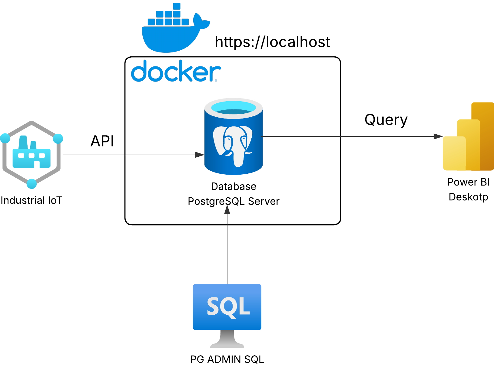

# DashBoard_Maintenance
An end-to-end industrial analytics project integrating IoT-style data, Dockerized PostgreSQL, SQL modeling, Power Query, DAX, and Power BI visualization.

🏭Este proyecto simula un flujo típico de datos industriales:
sensores IoT → base de datos PostgreSQL en Docker → modelado SQL → Power BI Desktop → dashboard analítico de fallas.
📦 1. Dataset utilizado

Dataset original:
Machine Predictive Maintenance Classification
Fuente: https://www.kaggle.com/datasets/shivamb/machine-predictive-maintenance-classification/data

Este dataset contiene 10,000 registros sintéticos generados con fines de modelado y análisis para sistemas de mantenimiento predictivo. Cada fila representa una pieza procesada por maquinaria industrial bajo diversas condiciones operativas
Estos datos, aunque sintéticos, simulan señales típicas de instrumentación industrial (IIoT) donde cada medición permite analizar patrones operativos y comportamientos de falla.

🐳 2. Entorno Docker + PostgreSQL
Para almacenar, consultar y modelar los datos utilicé Docker Desktop ejecutando un contenedor con:

- PostgreSQL 16
- Acceso local desde localhost:5432
- Gestión vía pgAdmin 4

  

